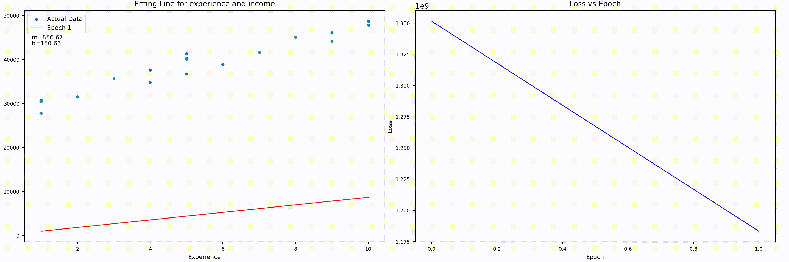

# Linear Regression with Gradient Descent Visualization

This project implements linear regression using gradient descent from scratch and visualizes the learning process through animation.

## Usage

The animation shows how the regression line evolves to fit the data points while minimizing the loss function.

## Requirements

- Python 3.x
- pandas
- matplotlib
- numpy
- ffmpeg (for saving animations)

